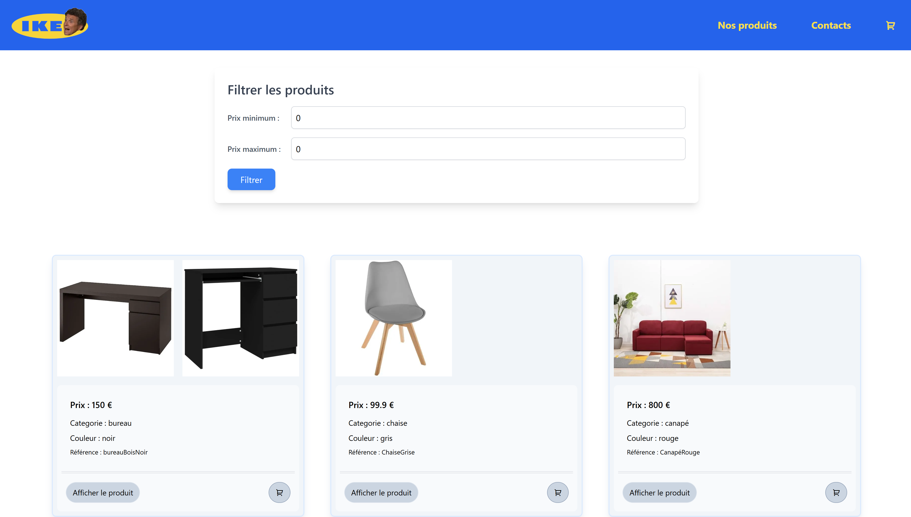
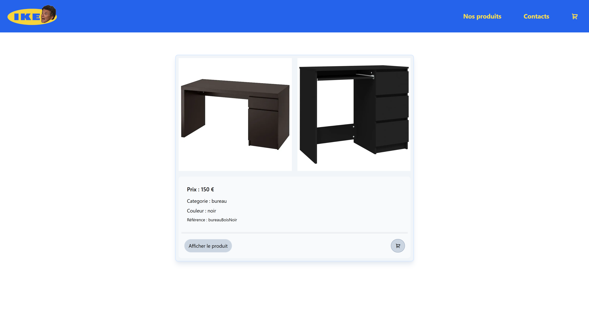

#Plateforme de meubles I-Key-Ah !

Réalisé avec Springboot et Angular. Ce projet a été construit en sept jours en deux équipes de trois. Une première partie du projet l'équipe A travaillait sur le front-end, et l'équipe B sur le back-end. La deuxième partie de la semaine, les deux équipes se sont interchangées.

  

Nos objectifs :
- Création d'un site from scratch.
- Liaison entre l'équipe back-end et front-end.
- Première utilisation du framework (springboot, angular, tailwind)Gérer et créer les liens entre la base de données et le projet.
- 

  

Ce site permet de :
- Afficher les différents produits du magasin de meubles.
- Filtrer ces meubles par prix.
- Afficher plus d'informations d'un meuble sur la page dynamiquement.
